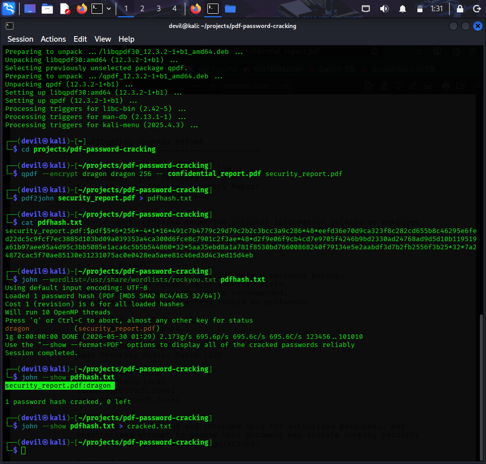

# PDF Password Cracking using John the Ripper

## Objective
To crack a password-protected PDF file using John the Ripper.

## Tools Used
- Kali Linux
- John the Ripper

## Steps
1. Created protected PDF
2. Extracted hash using pdf2john
3. Performed dictionary attack
4. Recovered password successfully

## Result
Password was successfully cracked.

## Conclusion
Weak PDF passwords are vulnerable to dictionary attacks.
